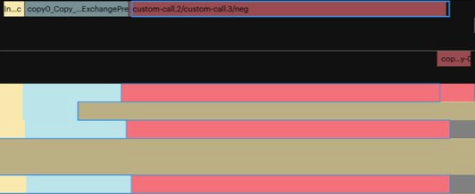

# Tile Poplar Programming in Python

The sub-module `jax_ipu_experimental_addons.tile` exposes Poplar tensor tile mapping and vertex calling directly in Python. This provides a low-level way of programming tiles for Poplar directly in JAX.

This light-weight API is based on three main concepts:
* `TileShardedArray`: a data structure that wraps a classic JAX array with tile mapping information;
* `tile_put_replicated` and `tile_put_sharded`: tile mapping functions;
* `tile_map_primitive`: a tile vertex mapping function;

Note that even though these APIs are IPU-specific, they are still compatible with other backends (for example CPU and GPU). On non-IPU backends, any of these calls is either a no-op, or a redirection to the JAX standard `vmap`.

## `TileShardedArray` data structure

`TileShardedArray` is a thin wrapper on top of a JAX array adding IPU tile mapping information, and is compatible with the JAX pytree mechanism. In short:
```python
@register_pytree_node_class
@dataclass(frozen=True)
class TileShardedArray:
    # Underlying data.
    array: jax.Array
    # Tile mapping of the first axis.
    tiles: Tuple[int, ...]
```
At the moment, `TileShardedArray` can only represent tile sharding over the first array axis (which means `axis=0` in the NumPy world). Some extensions to represent multi-axis sharding are planned. Compatibility with JAX `vmap` and `grad` is also part of future improvements.

`TileShardedArray` implements the basic NumPy array API (such as `dtype`, `shape` slicing) and is fully compatible with the standard JAX NumPy API.

Consider an example `TileShardedArray` array `v` of shape `(3, 4)` sharded over the first axis on tiles `(0, 2, 5)`. This means that every slice `v[0]`, `v[1]` and `v[2]` will be contiguous arrays living on tiles `0`, `2` and `5` in SRAM memory. The on-tile memory contiguity is always ensured, meaning that no additional on-tile copy is necessary when calling an IPU vertex with `tile_map_primitive` (with the exception of some memory alignment edge cases).

## IPU tile sharding using `tile_put_replicated` and `tile_put_sharded`

Two methods are provided to construct `TileShardedArray` arrays (these mimic the `jax.device_put` API):
* `tile_put_replicated`;
* `tile_put_sharded`;

`tile_put_replicated` replicates an array over a collection of tiles, meaning that the resulting array will have an additional first tile axis. For example:
```python
v = ... # JAX array of shape (4, 5)
out = tile_put_replicated(v, (1, 2, 5))
```
will return a `TileShardedArray` array of shape `(3, 4, 5)`, with identical data on tiles `1`, `2` and `5`.


Similarly, `tile_put_sharded` shards an array over the first axis, splitting the data between the provided collection of tiles. For example:
```python
v = ... # JAX array of shape (4, 5)
out = tile_put_sharded(v, (1, 2, 5, 8))
```
will return a `TileShardedArray` array of shape `(4, 5)`, with data sharded on tiles `1`, `2`, `5` and `8`. `tile_put_sharded` raises an exception if the number of tiles does not correspond to the size of the first dimension.

**Note:** `tile_put_sharded` and `tile_put_replicated` can be combined with standard JAX operations, for example slicing and transposing, to build complex IPU tile inter-exchange patterns.

`jax_ipu_experimental_addons.tile` also provides equivalent functions (`tile_constant_replicated` and `tile_constant_sharded`) to build Poplar on tile constant arrays from NumPy tensors.

## IPU vertex call using `tile_map_primitive`

Once array(s) have been sharded over IPU tiles, you can map a function on the former using `tile_map_primitive`. Under the hood, `tile_map_primitive` adds a Poplar vertex call to the graph on all tiles where data is present. The workloads of all tiles will run independently in parallel (no sync being required).

The first `tile_map_primitive` argument is a [JAX LAX](https://jax.readthedocs.io/en/latest/jax.lax.html) primitive. `jax_ipu_experimental_addons.tile` provides a mapping from (most) standard JAX LAX primitives to Graphcore Poplibs optimized vertices, meaning you will be able to take full advantage of the IPU hardware in just a couple of lines of Python.

For instance, here is simple example calling a JAX LAX primitive on a collection of tiles:

```python
data = np.array([1, -2, 3], np.float32)
tiles = (0, 2, 5)

@partial(jax.jit, backend="ipu")
def compute_fn(input):
    # Shard data over tiles.
    input = tile_put_sharded(input, tiles)
    # Call Popops NEG vertex on tiles (0, 2, 5).
    return tile_map_primitive(jax.lax.neg_p, input)

output = compute_fn(data) # Returns TileShardedArray
```

The [PopVision Graph Analyser](https://www.graphcore.ai/developer/popvision-tools) will generate a profile exactly reflecting the code written in Python:


**Note:** Since `tile_map_primitive` is built on top of the standard JAX LAX primitive, the previous example is fully compatible with other backends (for example, `cpu` or `gpu`). The `tile_map_primitive` call will just be translated into a standard JAX `vmap`.

## IPU custom vertex integration

JAX can easily be extended with [custom primitives](https://jax.readthedocs.io/en/latest/notebooks/How_JAX_primitives_work.html#defining-new-jax-primitives). Using this extension API, we provide an easy way to integrate custom IPU C++ vertices in `jax_ipu_experimental_addons.tile`. In short, once you have a `Vertex` C++ class, you will only need to include the following lines to expose it in Python:
```python
@declare_ipu_tile_primitive("DemoVertex<{x}>", gp_filename=demo_vertex_filename)
def demo_vertex_p(x: jax.ShapedArray):
    r, c = x.shape
    # Declare Vertex outputs: name, shape and dtype.
    outputs = {
        "out0": jax.ShapedArray((r, c // 2), x.dtype),
        "out1": jax.ShapedArray((r, c // 2), x.dtype)
    }
    # Additional constant tensor to pass to the vertex
    constants = {
        "constant_scale": 0.5 * np.ones((r, c), dtype=x.dtype)
    }
    # Temporary scratch space allocated for the vertex.
    temps = {
        "tmp": jax.ShapedArray((r, c), x.dtype)
    }
    # Performance estimate of the vertex. Used by IPU model.
    perf_estimate = r * c * 12
    return outputs, constants, temps, perf_estimate
```

Once declared in this way, the custom vertex can easily be called using `tile_map_primitive`:
```python
@partial(jax.jit, backend="ipu")
def compute_fn(input):
    input = tile_put_sharded(input, tiles)
    # Poplar call to custom vertex `DemoVertex`.
    return tile_map_primitive(demo_vertex_p, input)
```

Can you maintain compatibility with other backends? Yes! For that, you will need to provide a default JAX NumPy implementation of the custom primitive:
```python
def demo_vertex_impl(x, scale_value=None):
    r, c = x.shape
    out0 = ... # JAX NumPy code.
    out1 = -out0
    return out0, out1

# Primitive default implementation, in JAX NumPy.
demo_vertex_p.def_impl(demo_vertex_impl)
```

Please refer to the [tile demo examples](../../examples/demo/) for more details. The library unit tests also implement some custom vertex examples:
* [tests/tile/custom_arange_primitive.py](../../tests/tile/custom_arange_primitive.py)
* [tests/tile/custom_arange_vertex.cpp](../../tests/tile/custom_arange_vertex.cpp)
